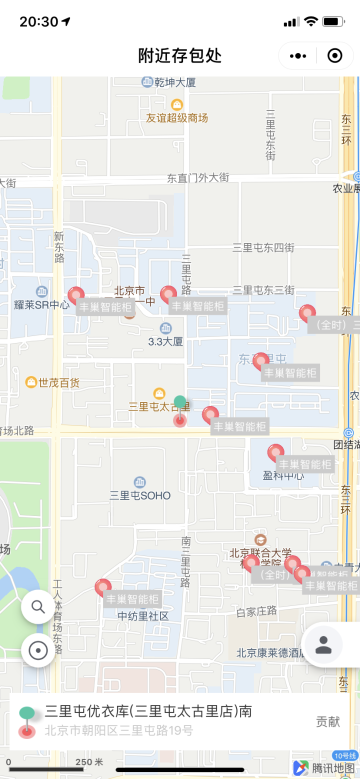
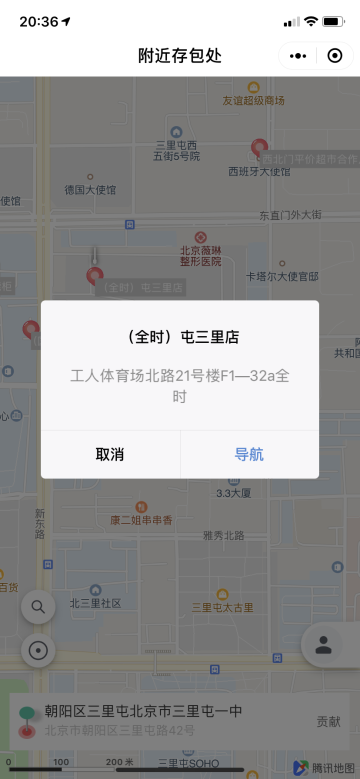

# 存包处

存包处是一个微信小程序，用于查找附近的行李寄存点

<figure class="third">
    
    
    
</figure>

源于我过年旅行，晚上的飞机回国，中午从酒店 checkout，拖着行李逛展很不方便，最后花钱定的酒店存起来了，想想周围有方便的行李寄存点应该不错

首次学习小程序，做的比较简陋，见谅

数据大部分抓取自网络，部分由志愿者录入

系统搭建采用了 AWS 的机器，Elasticsearch 和阿里云的存储

官网地址： https://www.cunbaochu.com/ ，可扫码使用

# 用户故事

1. 作为一个今晚回国的旅行者，我希望将行李存储在附近，以便于我能轻松的逛博物馆，而不用为此定一间房；
2. 作为一个购物者，我希望将已购买的东西存放在附近，以便于我能轻松的继续购物；
3. 作为一个在早晨到达某地的旅行者，我希望我能在民宿附近存下行李，以便我能立刻开始当天的游览；
4. 作为一个签证办理者，我希望我在办理签证过程中可以将手机等物品存放在附近，以便于通过大使馆的安检；
5. 作为一个商场附近的咖啡厅店主，我希望逛商场的人知道我这里可以存放行李，以便于我将空闲的地方利用起来，换取收益。

# 功能点

1. 默认查看附近存包处；
2. 搜索指定地点存包处；
3. 拖动查找指定位置存包处；
3. 用户贡献新的存包处。

# Refs

1. https://github.com/vedaAngie/wechat-map-applet-angie
